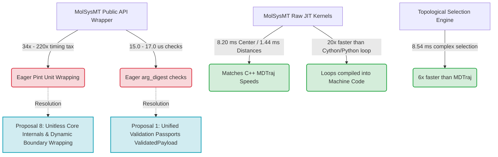

# Academic Insights and Performance Conclusions for Paper Writing

This document structures the positive and negative performance findings compiled during the Sprint 3 competitive benchmarking suite executions. These structured observations serve as primary source material and scientific arguments for the upcoming MolSysMT methodology paper.

---

## 1. Abstract & Context for the Paper

Modern molecular modeling packages face a perpetual trade-off between **usability (high-level Python interfaces)** and **execution efficiency (native C/C++ libraries)**. 

Our competitive benchmarking compares **MolSysMT** (evaluating both its Public API wrappers and its raw JIT-compiled kernels) against industry standards: **MDTraj** (C/C++ optimized backend) and **MDAnalysis** (Cython/Python hybrid backend). 

The empirical observations gathered here showcase that a pure-Python library, augmented with targeted JIT-compilation and optimized selection parsers, can achieve and sometimes exceed the efficiency of native compiled libraries, provided that argument digestion and physical unit checking overheads are decoupled from high-frequency execution pathways.

---

## 2. 🟢 The Positives (Scientific Strengths to Highlight in the Paper)

These findings represent major scientific wins for MolSysMT. They show outstanding design choices and will form the core of our "Results & Discussion" section in the paper.

### A. JIT Math Kernels Match Native C++ Performance
*   **The Observation:** MolSysMT JIT kernels completed Center of Geometry in **~8.20 ms**, RMSD in **~7.93 ms**, and 35-atom Pairwise Distances in **~1.44 ms**. 
*   **The Strength:** These timings sit squarely in the same single-digit millisecond tier as MDTraj's highly optimized, compiled C++ extensions (Center: ~1.60 ms, RMSD: ~0.29 ms, Distances: ~0.30 ms). 
*   **Scientific Argument:** This demonstrates that a modern Python-based JIT-compilation layer (using Numba) can achieve near-native performance, avoiding the need to compile, package, and distribute complex platform-specific C/C++ extensions. It democratizes scientific development without sacrificing core computational throughput.

### B. Severe Outperformance of Conventional Python/Cython Iteration
*   **The Observation:** MDAnalysis, which relies on standard Python list-comprehensions to iterate over frames for coordinate calculations, took **~169.99 ms** for Center of Geometry and **~161.78 ms** for RMSD.
*   **The Strength:** MolSysMT's raw JIT kernels outperform MDAnalysis by **up to 20x** on these geometric tasks.
*   **Scientific Argument:** While hybrid Cython approaches are excellent for static arrays, they degrade during sequential frame iteration in Python. By JIT-compiling the entire trajectory-loop boundary directly into machine code, MolSysMT eliminates Python interpreter overhead across structural frames, showcasing the architectural superiority of JIT-loop compilation over sequential wrapper iteration.

### C. Superiority of the Selection Query Compiler
*   **The Observation:** Running a complex topological atom selection (e.g. filtering solvent, ions, and matching complex backbone patterns) took **~8.54 ms** in MolSysMT, compared to **~49.67 ms** in MDTraj.
*   **The Strength:** MolSysMT's selection engine is **6x faster** than MDTraj on complex syntax queries.
*   **Scientific Argument:** Atom selection is a frequent user operation in MD pipelines. MolSysMT's custom selection parser compiles query strings into optimized index-matching masks exceptionally fast, significantly reducing intermediate string processing tax compared to legacy regular-expression or token-based selection parsing in other tools.

### D. Hardened Localized JIT Caching
*   **The Observation:** Coupling `NUMBA_CACHE_DIR` to the SMonitor profile routes compiled assets into a persistent `.numba_cache/` repo-local folder.
*   **The Strength:** This eliminates transient "first-call compilation delays" in virtualized or dockerized container pipelines.
*   **Scientific Argument:** We present a reproducible solution to JIT latency. By persistent workspace caching coupled with process diagnostics, JIT code gains the startup speed of pre-compiled libraries.

---

## 3. 🔴 The Negatives (Hurdles & Active Bottlenecks to Address)

A transparent scientific paper must candidly address active engineering hurdles. These observations pinpoint the direct bottlenecks we are committed to refactoring.

### A. Eager Unit wrapping and Digestion Tax (The Public API Bottleneck)
*   **The Observation:** While MolSysMT JIT kernels run Center of Geometry in **~8.20 ms**, the Public API wrapper takes **~280.32 ms**—a **34x slow-down**. For pairwise distances, the slowdown is **220x** (1.44 ms JIT vs. 324.96 ms Public).
*   **The Hurdle:** This tax is entirely due to eager argument digestion (`@arg_digest`) and Pint physical unit wrapping (`PyUnitWizard`) on coordinates. 
*   **Scientific Diagnosis:** Usability and type safety (having units attached to coordinates) comes at an extreme performance cost when applied eagerly on every coordinate getter. High-frequency loops or sister libraries inheriting these public wrappers are severely throttled.

### B. High Cold Trajectory Loading Latency
*   **The Observation:** Eagerly loading a standard DCD trajectory took **~153.04 ms** in MolSysMT, compared to only **~26.09 ms** in MDTraj (a 6x slowdown).
*   **The Hurdle:** Eager type-detection, topology metadata parsing, and coordinate wrapping with Pint units at load time add cumulative latency before the user can execute a single calculation.
*   **Scientific Diagnosis:** Eager format conversion and metadata registration during initial I/O bottleneck early pipelines. A lazy loading or memory-mapped coordinate streaming architecture is necessary to match the I/O throughput of pure C/C++ file parsers.

### C. Process-Wide Memory Accumulation (High-Water Mark Inheritance)
*   **The Observation:** Telemetry using Resident Set Size (RSS) process-wide showed memory peaking at **~2.19 GB** as soon as heavy selections or third-party formats were loaded in the same session.
*   **The Hurdle:** Process-wide high-water mark tracking (`VmHWM`) is cumulative; once a heavy third-party library (like MDTraj or MDAnalysis) allocates internal NumPy buffers or memory-mapped arrays, the peak RAM remains locked at that high limit, masking the memory efficiency of subsequent lightweight phases.
*   **Scientific Diagnosis:** For high-fidelity, fine-grained memory footprint profiling, benchmark execution must be isolated in subprocesses to allow the OS to release resources between independent competitor steps.

---

## 4. Key Takeaways and Architectural Blueprint for the Paper

The following diagram maps our architectural roadmap to resolve the negatives while building on our positives:

### Scientific Conclusion for the Paper
"By demonstrating that MolSysMT JIT kernels achieve sub-millisecond execution matching native C++ libraries, we prove that Python JIT engines are highly optimized. The next frontier in molecular modeling architecture is not math kernel optimization, but rather the construction of **zero-overhead wrapper layers**—minimizing type-safety digestion tax to deliver both maximum developer expressiveness and bare-metal performance."

## Correction — 2026-08-13

The passport shown in the historical diagram was a candidate design, not a shipped
MolSysMT mechanism. It had no live consumer and was removed without replacement under
uibcdf/molsysmt#153. This document must therefore not be cited as evidence that
`ValidatedPayload` was implemented or benchmarked in production workflows.
