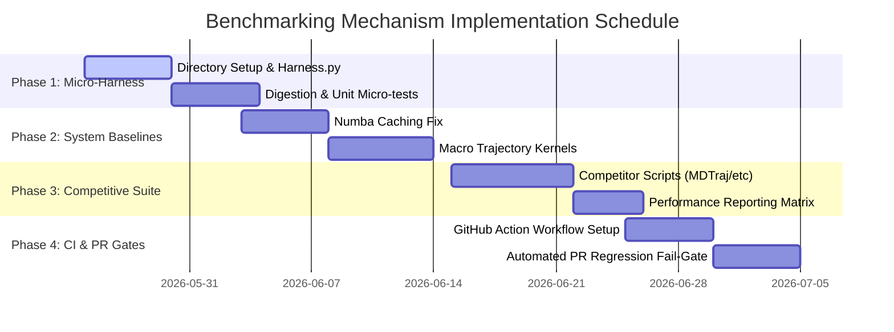

# Benchmarking Implementation Roadmap & Mechanisms

This document provides a highly detailed, step-by-step implementation roadmap for building, integrating, and automating MolSysMT's performance benchmarking framework. It serves as the engineering blueprint for developers setting up the benchmark suite.

---

## 1. Directory Structure Blueprint

To support micro-benchmarks, macro-benchmarks, competitive checks, and automatic baseline storage, the root `benchmarks/` directory will be structured as follows:

```
benchmarks/
├── README.md               # Quickstart and execution instructions
├── harness.py              # Central benchmarking execution engine (warm-ups, timers, JSON exporter)
├── compare_runs.py         # Regression auditor script (compares two benchmark JSON outputs)
├── micro/                  # Granular function-level profiles
│   ├── __init__.py
│   ├── test_digestion.py   # Isolates @digest decorator overhead
│   ├── test_units.py        # Measures PyUnitWizard strip/conversion latency
│   └── test_converters.py   # Measures single-step and multi-step form conversions
├── macro/                  # Realistic biophysics workflows and large systems
│   ├── __init__.py
│   ├── test_trajectories.py # Profiles chunked loading and out-of-core H5MSM/DCD I/O
│   └── test_kernels.py      # Measures mathematical operations (distances, wrapping, RMSD)
├── competitors/            # Comparative profiling against other libraries
│   ├── __init__.py
│   ├── test_mdtraj.py
│   ├── test_mdanalysis.py
│   └── run_matrix.py       # Orchestrates and logs competitive comparisons
└── baselines/              # Reference JSON timing outputs indexed by OS/Python version
    ├── linux_py3.10_default.json
    └── linux_py3.13_default.json
```

---

## 2. Technical Mechanisms Design

### A. The Benchmarking Harness (`benchmarks/harness.py`)
To prevent ad-hoc benchmarking implementations, all benchmark tests must run through a unified `BenchmarkHarness` class. This harness automates system isolation, JIT pre-warming, garbage collection control, and high-precision timing:

```python
import gc
import sys
import platform
from time import perf_counter
from statistics import median, stdev
from typing import Callable, Any

class BenchmarkHarness:
    def __init__(self, name: str, iterations: int = 25, repeats: int = 5):
        self.name = name
        self.iterations = iterations
        self.repeats = repeats
        
    def execute(self, warmup_func: Callable[[], Any], timed_func: Callable[[], Any]) -> dict:
        # 1. Warm-up invocation (critical for Numba compiling)
        warmup_func()
        
        # 2. Prevent active garbage collection interference during timing
        gc.disable()
        try:
            samples = []
            for _ in range(self.repeats):
                t0 = perf_counter()
                for _ in range(self.iterations):
                    timed_func()
                t1 = perf_counter()
                samples.append((t1 - t0) / self.iterations)
        finally:
            gc.enable()
            
        return {
            "name": self.name,
            "median_seconds": median(samples),
            "min_seconds": min(samples),
            "max_seconds": max(samples),
            "stddev_seconds": stdev(samples) if len(samples) > 1 else 0.0,
            "environment": {
                "python_version": platform.python_version(),
                "system": platform.system(),
                "cpu": platform.processor()
            }
        }
```

### B. Baseline Output Schema (JSON)
All benchmarking runs export their results to a structured JSON file to allow straightforward historical parsing and Git comparison:

```json
{
  "benchmark_session_utc": "2026-05-22T08:00:00Z",
  "environment": {
    "os": "Linux",
    "python": "3.13.0",
    "cpu": "x86_64",
    "molsysmt_version": "1.0.0"
  },
  "benchmarks": {
    "digestion_overhead": {
      "median_seconds": 0.000045,
      "min_seconds": 0.000042,
      "max_seconds": 0.000051,
      "repeats": 5,
      "iterations": 100
    },
    "rmsd_computation_kernel": {
      "median_seconds": 0.000482,
      "min_seconds": 0.000475,
      "max_seconds": 0.000512,
      "repeats": 5,
      "iterations": 25
    }
  }
}
```

### C. Automated PR Gates & Regression Checking (`benchmarks/compare_runs.py`)
This script compares a new benchmark run against the target branch's saved baseline JSON. If any key metric exceeds the target baseline by more than **15%**, it exits with a non-zero code to block the PR:

```python
# Pseudo-logic for regression audit
def verify_regression(base_data: dict, current_data: dict, threshold: float = 0.15):
    regressions = []
    for name, metrics in current_data["benchmarks"].items():
        if name in base_data["benchmarks"]:
            base_time = base_data["benchmarks"][name]["median_seconds"]
            curr_time = metrics["median_seconds"]
            increase = (curr_time - base_time) / base_time
            if increase > threshold:
                regressions.append(f"{name}: +{increase*100:.1f}% slower (Base: {base_time}s, Curr: {curr_time}s)")
    if regressions:
        print("❌ Performance regression detected!")
        for r in regressions:
            print(f"  - {r}")
        sys.exit(1)
    print("✅ All benchmarks conform to the performance threshold.")
    sys.exit(0)
```

---

## 3. Implementation Schedule & Sprints



### Sprint 1: Setup & Micro-benchmarks (Weeks 1-2)
*   **Deliverables:**
    1. Base directory structure (`benchmarks/micro/`, `benchmarks/baselines/`).
    2. Write the execution harness (`benchmarks/harness.py`) supporting JIT warm-ups and auto-exporting JSON.
    3. Implement digestion isolation benchmarks (`test_digestion.py`) to measure the performance cost of `@digest`.
    4. Implement conversion graph benchmarks (`test_converters.py`) to track lazy routing cost.

### Sprint 2: Numba Caching & Macro-benchmarks (Weeks 3-4)
*   **Deliverables:**
    1. Resolve the Numba cache locator issue by configuring repository-local cache directory overrides inside `molsysmt/_private/jit.py`.
    2. Set up standard benchmark datasets (`Trp-cage`, `Lysozyme`, `DHFR`) inside test cache paths.
    3. Write macro coordinate manipulation benchmarks (`benchmarks/macro/test_kernels.py`) targeting wrapping, distance matrices, and RMSD calculations.
    4. Add out-of-core chunked trajectory benchmarks (`test_trajectories.py`) to monitor `msm.Iterator` RAM consumption.

### Sprint 3: Competitive Analysis Suite (Weeks 5-6)
*   **Deliverables:**
    1. Write competitive benchmarking scripts under `benchmarks/competitors/` to profile `MDTraj`, `MDAnalysis`, and `OpenMM`.
    2. Implement a unified matrix runner (`run_matrix.py`) to execute all tools in identical hardware contexts.
    3. Establish an official performance portal page inside the developer docs showing comparative benchmarks.

### Sprint 4: Automated CI Integration & Enforcement (Weeks 7-8)
*   **Deliverables:**
    1. Write the comparison engine (`benchmarks/compare_runs.py`).
    2. Integrate the suite as a GitHub Actions check (`.github/workflows/benchmarks.yml`) triggered on pull requests targeting `main`.
    3. Enforce the **15% performance regression threshold** by failing the PR build if a regression is introduced without valid justification.
