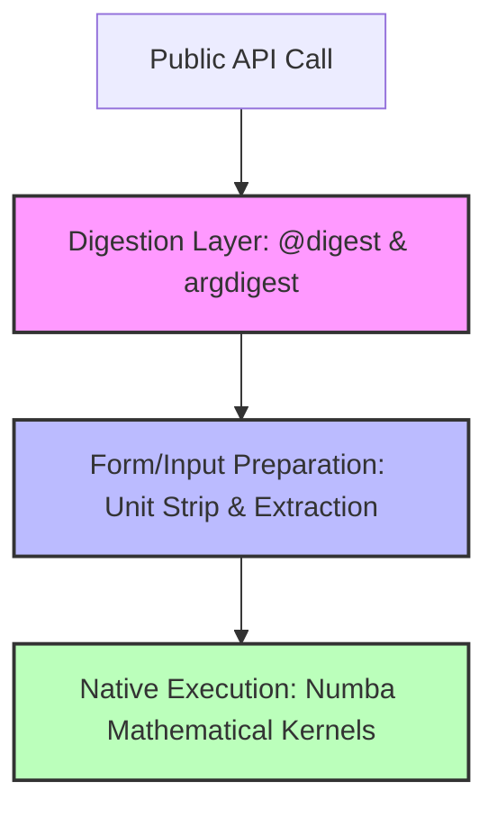

# Benchmarking Strategy and Policies

This directory defines the central performance strategy, timing policies, regression limits, and competitive comparison plans for the MolSysMT package.

## Vision Statement

MolSysMT is designed as a highly interoperable, form-agnostic framework that guarantees topological and physical-unit safety across various molecular simulation representations. However, safety and interoperability must not come at the cost of unacceptable runtime degradation. 

Our benchmarking framework serves to:
1. **Empirically measure and control the overhead** introduced by the argument digestion (`@digest`) and type-validation safety layers.
2. **Ensure high-performance execution** of native mathematical kernels (e.g., using Numba-compiled functions).
3. **Guard against performance regressions** during refactoring, package upgrades, or addition of new conversion adapters.
4. **Compare systematically and transparently** with industry-standard packages (`MDTraj`, `MDAnalysis`, `BioPython`, `OpenMM`) to identify optimization targets.

---

## Core Performance Pillars

MolSysMT's performance profile is divided into three distinct layers, which must be benchmarked and optimized independently:



1. **Digestion Overhead:** The cost of validating arguments, mapping selections, and resolving unit containers. This layer is Python-heavy and has a constant overhead per call.
2. **Form and Input Preparation:** The cost of converting structural and topological representations into unit-agnostic NumPy arrays.
3. **Native Kernel Execution:** The core mathematical algorithms (e.g., distance computations, wrapping, RMSD) compiled with Numba (`njit`). This layer is extremely fast and scales with the size of the molecular system.

---

## Developer Execution & Benchmarking Policies

To ensure that benchmarking is deterministic, reliable, and reproducible across different developer environments, all benchmark contributions must adhere to the following policies:

### 1. The 15% Regression Rule
No Pull Request or internal refactor may introduce a performance regression greater than **15%** on any core benchmark baseline (such as the coordinate path benchmarks in `benchmarks/structure_coordinate_paths.py`) without a detailed architectural justification approved by the repository maintainers. If a regression is unavoidable (e.g., due to an essential security fix or standard change), the baseline metrics must be officially updated and documented.

### 2. Numba JIT Warm-Up Policy
Numba compiles code lazily upon its first invocation. To avoid measuring the compilation overhead in runtime benchmarks, **every benchmarking script must run at least one warm-up execution of all JIT-compiled kernels** using dummy or representative inputs before starting the high-resolution timer.
* **Incorrect:**
  ```python
  # Compiles and runs inside the timed block
  t0 = perf_counter()
  msm.structure.get_distances(xyz)
  t1 = perf_counter()
  ```
* **Correct:**
  ```python
  # Warm up compilation
  msm.structure.get_distances(xyz)
  # Measure actual execution
  t0 = perf_counter()
  for _ in range(iterations):
      msm.structure.get_distances(xyz)
  t1 = perf_counter()
  ```

### 3. PyUnitWizard and Unit Strip Policy
Unit parsing is a costly operation. High-frequency loops or hot-path utility functions must never parse or convert units internally. The calling wrapper must strip and extract units beforehand using fast-track pathways (such as `molsysmt._pyunitwizard.value_type` or `puw.fast_track`), and pass raw numeric arrays to JIT-compiled mathematical kernels. Benchmarks must separately assert the performance of unit-stripped kernels to verify that unit digestion is not leaking into execution loops.

### 4. Deterministic Environment Isolation
To ensure baseline reproducibility, benchmarks must be executed with:
- **`NUMBA_DISABLE_CACHE=1`** (or in highly isolated environments where caching is carefully tracked and cleared). This prevents unstable JIT caches from skewing timings across multiple runs.
- **Constant repeats and iterations:** Measurements must report median, minimum, and maximum call rates across multiple trials (e.g., minimum 5 repeats, with 10-25 internal iterations depending on execution scale).

---

---

## The Public Benchmarking Dashboard

To present our performance telemetry transparently, MolSysMT features a premium, interactive **Single-Page Benchmarking Dashboard** embedded directly in the Sphinx developer documentation.

### 1. Dashboard Architecture
- **HTML/JS Source**: [docs/_static/benchmarks_dashboard.html](file:///home/diego/repos@uibcdf/molsysmt/docs/_static/benchmarks_dashboard.html)
- **Dynamic Fetch Data**: Loads baseline JSON metrics dynamically from [docs/_static/benchmarks_data/](file:///home/diego/repos@uibcdf/molsysmt/docs/_static/benchmarks_data/) (which holds static copies of baseline JSON files copied during compilation / manual handoffs).
- **Core Libraries**: Built using Tailwind CSS (for custom glassmorphic aesthetics on a sleek dark-mode canvas) and Chart.js (for animated, responsive data visualizations).
- **Interactive Tabs**:
  1. *Ecosystem Competitors*: Bar and doughnut charts illustrating CPU speedups and peak memory RSS deltas comparing MolSysMT, MDTraj, and MDAnalysis.
  2. *API vs. JIT (Overhead)*: Displays the overhead comparison between public API validation boundaries and raw JIT math kernels.
  3. *Trajectory Scalability*: Visualizes performance across eager, iterator, and chunked trajectory streaming models.
  4. *Micro Overhead*: Tracks microsecond digestion and physical unit checking taxes.

### 2. Documentation Embed
The dashboard is embedded cleanly into [docs/content/developer/benchmarks.md](file:///home/diego/repos@uibcdf/molsysmt/docs/content/developer/benchmarks.md) using a responsive, shadow-styled HTML iframe:
```markdown
.. raw:: html

   <iframe src="../../_static/benchmarks_dashboard.html" 
           style="width: 100%; height: 950px; border: none; border-radius: 16px; ...">
   </iframe>
```

---

## Directory Navigation

- [Current Baseline Status](file:///home/diego/repos@uibcdf/molsysmt/devguide/benchmarking/status.md) — Current inventory of benchmark scripts and timing metrics.
- [Benchmarking Roadmap](file:///home/diego/repos@uibcdf/molsysmt/devguide/benchmarking/roadmap.md) — Future benchmarks, micro/macro separation, and CI regression testing plans.
- [Experimental Ideas](file:///home/diego/repos@uibcdf/molsysmt/devguide/benchmarking/ideas.md) — Numba cache solutions, memory views, and profiling tools under study.
- [Competitive Comparison Strategy](file:///home/diego/repos@uibcdf/molsysmt/devguide/benchmarking/competitive_comparison.md) — Strategy and protocols for comparison with MDTraj, MDAnalysis, OpenMM, and BioPython.
- [Competitive Comparison Results](file:///home/diego/repos@uibcdf/molsysmt/devguide/benchmarking/competitive_comparison_results.md) — Live benchmark timings, competitive analysis, and safety-versus-performance trade-offs.
- [Sphinx Benchmarks Page](file:///home/diego/repos@uibcdf/molsysmt/docs/content/developer/benchmarks.md) — The compiled documentation guide embedding the live dashboard.

